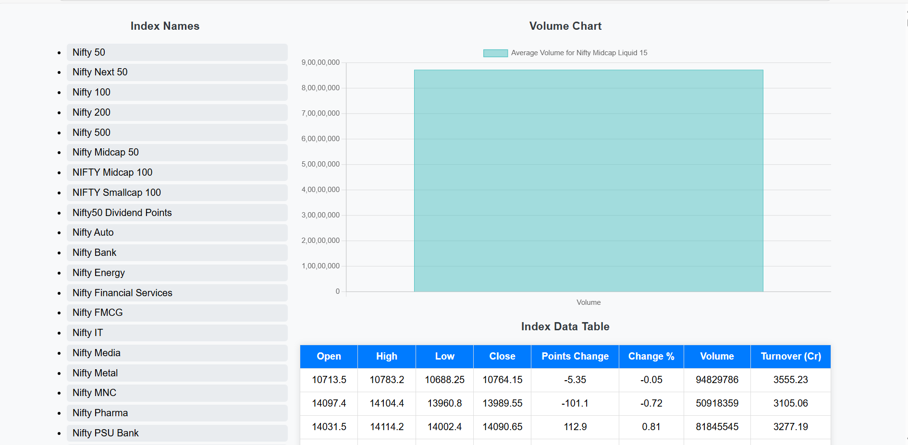

Stock App Webpage

Overview

This is a simple stock index dashboard that displays stock index names, a volume chart, and a table with detailed index data. The user can select an index name from the list to view its corresponding volume chart and metrics.

Project Structure

templates/: Contains the HTML file (index.html) for the user interface.

static/: Contains the CSS (style.css) for styling and JavaScript (script.js) for dynamic behavior.

app.py: Flask backend to serve the webpage and API endpoints.

dump.csv: Data source containing stock index metrics.

Features

Index List: Displays stock indices for user selection.

Volume Chart: Updates dynamically based on the selected index.

Data Table: Shows detailed stock metrics for the selected index.

Installation

Clone the repository:

git clone 

Create a virtual environment and activate it:

python -m venv venv
source venv/bin/activate  # On Windows: venv\Scripts\activate

Install dependencies:

pip install flask pandas

Ensure dump.csv is in the project directory.

Running the Application

Start the Flask server:

python app.py

Open your browser and navigate to:

http://127.0.0.1:5000

API Endpoint

Fetch index-specific data:

GET /api/company/<index_name>

Example Output

Volume chart for the selected index.

Data table with metrics like open, high, low, close, points change, change %, volume, and turnover.

Contributors

Your Name : Adarsa Swain